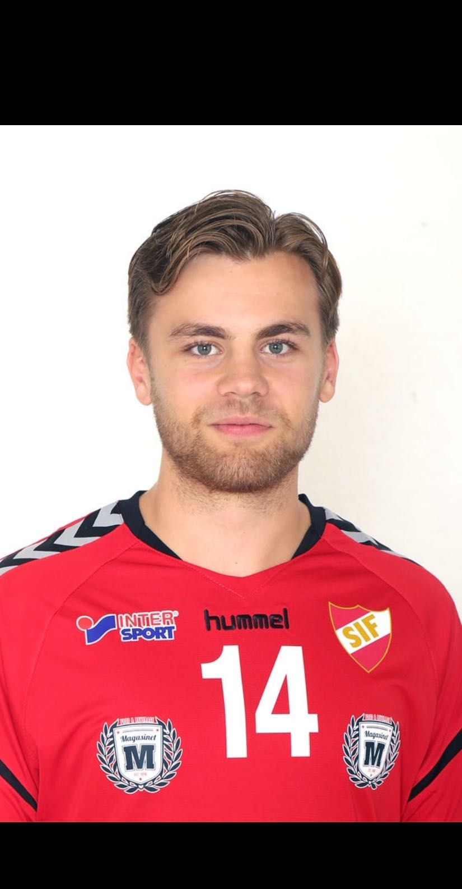
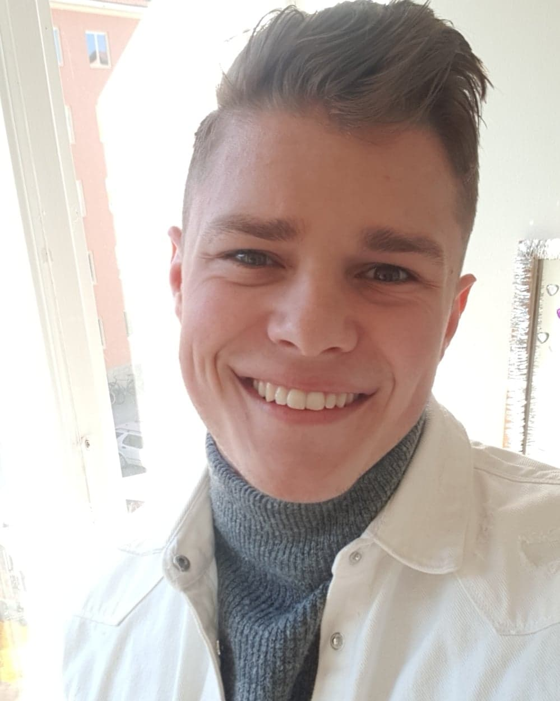
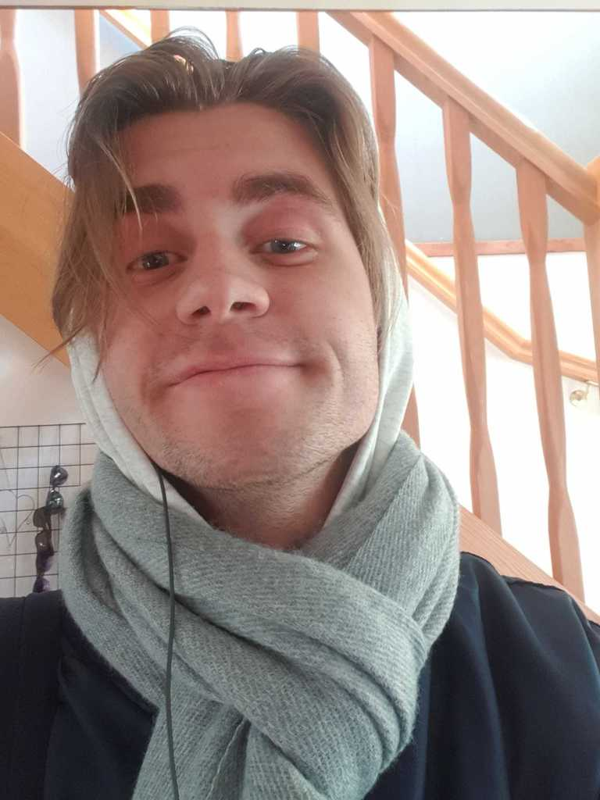
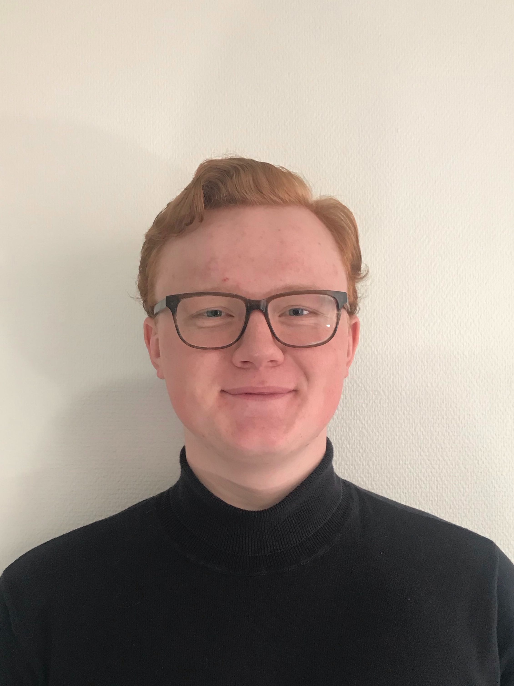
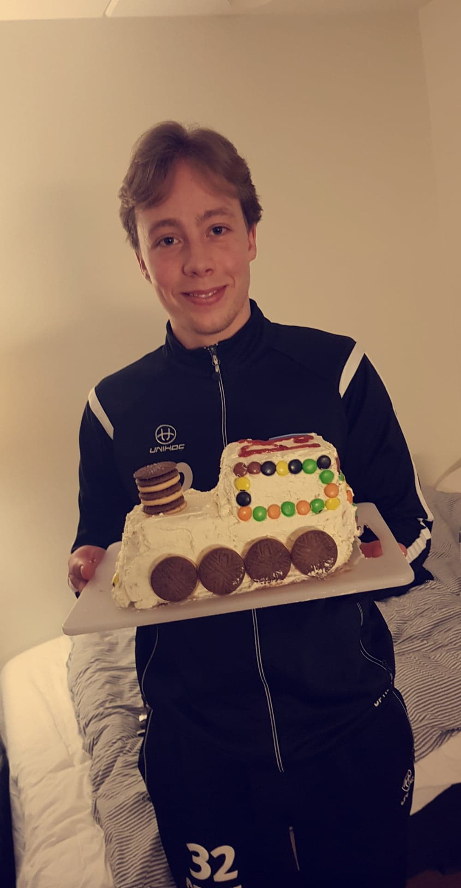
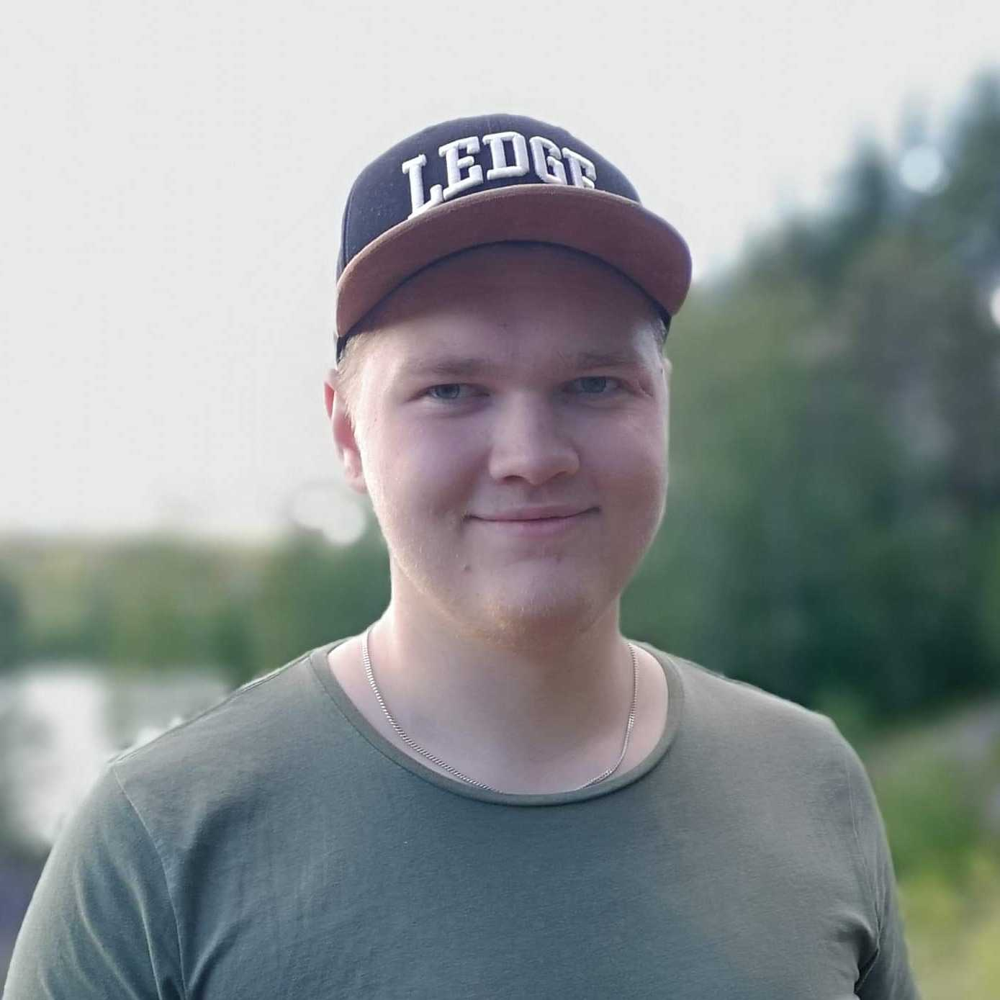

# Medlemmar (Bossy)

Projektarbete på kursen Datorsystem med projektarbete (1DT003) 
(1DT096) våren 2020, Uppsala universitet.

Bild | Förnamn | Efternamn | Personnummer | Användarnamn (GitHub)
-----------------------------------------|-----------------------------|-----------|--------------|----------------------
 | [Adam](#adam-axelsson) | Axelsson | 970810-0798 | `adamaxelsson`
 | [August](#august-bredberg) | Bredberg | 980921-0330 | `AugustBredberg`
 | [Erik](#erik-norén) | Norén | 980227-2410 | `erno3194`
 | [Fredrik](#fredrik-yngve) | Yngve | 980202-7913 | `fryn4538`
 | [Petter](#petter-jerndal) | Jerndal | 980219-6197 | `peje5968`
 | [Robert](#robert-paananen) | Paananen | 990106-4478 | `pottfisk`

## August Bredberg

### Okänd talang
Har relativt gröna fingrar.

### På fritiden
Små spel-projekt som involverar kompisar på olika sätt.
Mycket filmtittande.

### Starka sidor

Under projektet tror jag att jag kommer ha lättast att bidra med:
Är bra på att organisera och planera möten och design specifikation.
Är bra på att skriva kod utifrån specifikation.
Är bra på problemlösning.
Är bra på muntliga presntationer.
Är bra på research.

### Personlig utveckling

Under projektet hoppas jag förutom att bli ännu bättre på mina redan starka
sidor även ges möjlighet att utveckla följande färdigheter, till exempel:
- planering
- samarbete
- research (söka och sammanställa information)
- dokumentation
- rapportskrivande
- muntlig presentation

## Erik Norén

### Okänd talang

Vid sidan av mina studier är mitt huvudintresse musik, både att lyssna och att spela gitarr själv.

### Starka sidor

Under projektet tror jag att jag kommer ha lättast att bidra med:

- skriva kod utifrån färdig specifikation
- planering
- ledarskap
- muntlig presentation

## Petter Jerndal

### Okänd talang

På fritiden spelar jag innebandy och en okänd talang jag har är att jag kan jonglera och lösa rubiks kub.

### Starka sidor

Det jag tror är mina starka sidor under projektet är att lösa konkreta problem. Strukturera upp arbete och att planera arbete och dela upp arbetsbördan på ett effektivt sätt och att presentera saker muntligt.

### Personlig utveckling

Under projektet hoppas jag förutom att bli ännu bättre på mina redan starka
sidor även ges möjlighet att utveckla följande färdigheter, till exempel:

- analys/design/specifikation
- problemlösning och algoritmer
- samarbete

## Fredrik Yngve

### Okänd talang

Kan känna skillnad på A4-ark som väger 80 respektive 90 gram.

### Starka sidor

Under projektet tror jag att jag kommer ha lättast att bidra med:

- problemlösning
- samarbete
- skriva kod
- muntlig presentation

### Personlig utveckling

Under projektet hoppas jag förutom att bli ännu bättre på mina redan starka
sidor även ges möjlighet att utveckla följande färdigheter, till exempel:

- design
- analysering och optimering
- skriva strukturerad kod

## Adam Axelsson

### Okänd talang

När jag inte studerar tycker jag om att spela handboll.

### Starka sidor

Under projektet tror jag att jag kommer ha lättast att bidra med:

- problemlösning och algoritmer
- samarbete
- rapportskrivande
- muntlig presentation

### Personlig utveckling

Under projektet hoppas jag förutom att bli ännu bättre på mina redan starka
sidor även ges möjlighet att utveckla följande färdigheter, till exempel:

- skriva kod utifrån färdig specifikation
- research (söka och sammanställa information)
- lära mig hur man skapar appar

# Robert Paananen

### Okänd talang
Jag är väldigt bra på att dricka öl.
  
### Starka sidor

Under projektet tror jag att jag kommer ha lättast att bidra med:

- Problemlösning och algoritmer
- Datastrukturer
- skriva kod utifrån färdig specifikation

### Personlig utveckling

Under projektet hoppas jag förutom att bli ännu bättre på mina redan starka
sidor även ges möjlighet att utveckla följande färdigheter, till exempel:

- planering
- samarbete
- research (söka och sammanställa information)
- dokumentation
- rapportskrivande
- muntlig presentation
